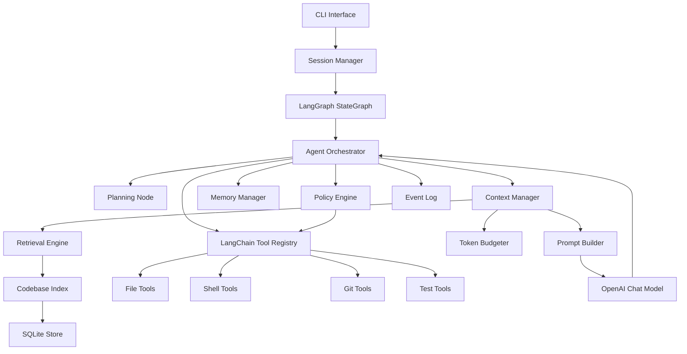
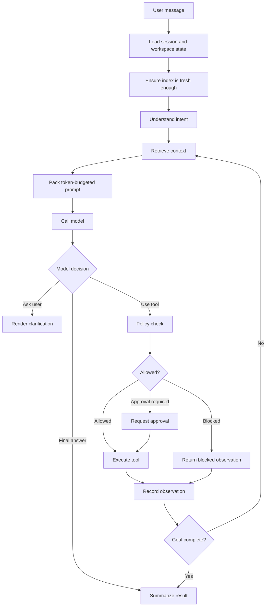

# Coding Agent From Scratch: Production Build Plan

> Source reference: [coding-agent-system-design-interview.md](./coding-agent-system-design-interview.md)

> This document keeps the interview guide unchanged and converts it into a production project plan for building a Claude Code-like coding agent from scratch.

## Goal

Build a production-grade coding agent that can operate inside a developer's local repository, understand the codebase, retrieve relevant context, plan changes, edit files safely, run tests, debug failures, maintain memory, and produce verified code changes through an interactive CLI-first experience.

## Product Positioning

The first production version should be a **local CLI coding agent** with a modular core that can later support IDE extensions, hosted execution, web UI, team memory, and multi-agent workflows.

The project should optimize for correctness, safety, and developer trust before optimizing for broad automation.

## Plan Maintenance Rule

This document is the implementation source of truth. If the project intentionally chooses a different approach from what is written here, update this plan as part of that change so the codebase and plan stay aligned.

## Proposed Working Name

`forge-agent`

The name is only a placeholder for planning. Python package/module names should stay generic enough to rename later without architectural churn.

---

# 1. Product Scope

## 1.1 MVP Scope

The MVP should support:

- Running inside a local repository.
- Interactive CLI chat loop.
- Reading and searching files.
- Building a lightweight codebase index.
- Retrieving relevant files and snippets.
- Planning multi-step coding tasks.
- Applying patch-based file edits.
- Running user-approved shell commands.
- Running targeted tests.
- Debugging based on test output.
- Maintaining session state.
- Maintaining local long-term memory.
- Showing diffs before or after edits.
- Enforcing sandbox and safety policies.
- Producing a final summary with verification evidence.

## 1.2 Post-MVP Scope

Post-MVP should add:

- IDE extension.
- Language Server Protocol integration.
- Tree-sitter AST indexing.
- Vector embeddings.
- Persistent task history.
- Multi-agent delegation.
- Browser/UI testing.
- Remote workspace execution.
- Team-shared memories.
- Evaluation harness and benchmark suite.
- Plugin/tool marketplace.

# 2. Users and Workflows

## 2.1 Primary Users

| User | Need |
| --- | --- |
| Application developer | Implement features and fix bugs in an existing repo |
| Tech lead | Ask architecture questions and request scoped refactors |
| Open-source maintainer | Triage issues and generate patches |

## 2.2 Core Workflows

### Workflow A: Explain Code

```text
User: "Explain how authentication works in this repo."
Agent:
1. Searches auth-related files.
2. Reads routes, middleware, user model, and tests.
3. Summarizes flow with file references.
4. Mentions uncertainty if important files were not found.
```

### Workflow B: Fix Failing Test

```text
User: "Fix the failing login test."
Agent:
1. Finds login tests.
2. Runs the failing test if permitted.
3. Reads failure output.
4. Retrieves implementation files.
5. Plans a fix.
6. Applies a minimal patch.
7. Reruns targeted tests.
8. Reports result and remaining risk.
```

### Workflow C: Implement Feature

```text
User: "Add password reset."
Agent:
1. Clarifies requirements if needed.
2. Inspects auth architecture.
3. Creates an implementation plan.
4. Updates models, routes, services, and tests.
5. Runs targeted tests and typecheck.
6. Summarizes changes.
```

### Workflow D: Refactor Safely

```text
User: "Extract this billing logic into a service."
Agent:
1. Finds current implementation.
2. Finds callers and tests.
3. Creates behavior-preserving plan.
4. Applies patch.
5. Runs related tests.
6. Shows diff and verification.
```

---

# 3. Functional Requirements

| ID | Requirement | Description |
| --- | --- | --- |
| FR-001 | Repository discovery | Detect root, Python project manager, scripts, language, framework, ignore rules |
| FR-002 | File search | Search files by path, filename, extension, and content |
| FR-003 | File read | Read files with line numbers and size limits |
| FR-004 | File edit | Apply safe patch-based edits |
| FR-005 | Diff tracking | Track and display agent-made changes |
| FR-006 | Shell execution | Run commands through policy checks |
| FR-007 | Test execution | Run targeted tests, typecheck, lint, and build commands |
| FR-008 | Code indexing | Build file, symbol, text, config, and test indexes |
| FR-009 | Retrieval | Retrieve relevant code using hybrid search |
| FR-010 | Context packing | Build token-budgeted model context |
| FR-011 | Planning | Produce and maintain task plans |
| FR-012 | Agent loop | Observe, reason, act, verify, and replan |
| FR-013 | Memory | Maintain short-term and long-term memory |
| FR-014 | Prompt assembly | Construct stable prompts with instructions, context, tools, and state |
| FR-015 | Tool registry | Register, validate, and execute tools consistently |
| FR-016 | Safety policies | Block or request approval for risky actions |
| FR-017 | Secret protection | Detect and mask secrets in prompts and logs |
| FR-018 | Session persistence | Save task state, events, messages, and edits |
| FR-019 | Final reporting | Summarize changes, tests, risks, and next steps |
| FR-020 | Configuration | Support project and user configuration files |
| FR-021 | OpenAI model integration | Use OpenAI models through a focused LangChain-compatible model adapter |
| FR-022 | Observability | Emit structured logs, traces, and metrics |
| FR-023 | Evaluation | Run benchmark tasks against sample repos |

---

# 4. Non-Functional Requirements

| ID | Requirement | Target |
| --- | --- | --- |
| NFR-001 | Safety | Destructive commands require approval |
| NFR-002 | Correctness | Agent must read relevant files before editing them |
| NFR-003 | Recoverability | Failed edits must not corrupt files |
| NFR-004 | Latency | Simple explain/search tasks should start responding within 3 seconds after indexing |
| NFR-005 | Scalability | Support repositories with at least 100k files through ignore rules and incremental indexing |
| NFR-006 | Privacy | Repo content remains local unless explicitly sent to OpenAI for a model call |
| NFR-007 | Auditability | Every tool action is recorded with inputs, outputs, timestamps, and status |
| NFR-008 | Extensibility | New tools, retrievers, and LangGraph nodes can be added without rewriting the orchestrator |
| NFR-009 | Portability | Support macOS, Linux, and Windows |
| NFR-010 | Testability | Core modules have unit tests; agent flows have integration tests |
| NFR-011 | Token efficiency | Context manager enforces budgets and trims noisy output |
| NFR-012 | Developer trust | Agent explains risky actions and verification evidence |

---

# 5. Recommended Tech Stack

## 5.1 Core Runtime

| Layer | Choice | Reason |
| --- | --- | --- |
| Language | Python 3.11+ | Strong AI ecosystem, mature filesystem/process APIs, and first-class LangChain/LangGraph support |
| Agent framework | LangGraph | Durable graph-based agent orchestration with explicit state transitions |
| Tool framework | LangChain tools | Standard tool abstraction for model-callable actions |
| Model | OpenAI only | Reduces provider complexity and keeps the first build focused |
| CLI framework | Typer | Clean Python CLI with type hints and good help output |
| Terminal UI | Rich | Professional streaming output, panels, prompts, and diff rendering |
| Validation | Pydantic v2 | Runtime validation for config, tool input, model output, and persisted state |
| Testing | pytest | Mature Python unit and integration testing |
| Formatting/linting | Ruff | Fast linting, import sorting, and formatting |
| Packaging | pip + venv | Simple Python dependency management with standard virtual environments |

## 5.2 Indexing and Retrieval

| Capability | MVP Choice | Later Upgrade |
| --- | --- | --- |
| File discovery | Native FS + `.gitignore` parser | Watchman |
| Text search | `ripgrep` subprocess when available, Python fallback | SQLite FTS |
| Symbol extraction | Regex/light parser for common languages | Tree-sitter |
| Metadata store | SQLite | SQLite + vector extension |
| Vector search | Optional after MVP | Local vector DB with OpenAI embeddings |

## 5.3 Model and Agent Framework

The first implementation should use OpenAI only. The code should still isolate OpenAI access behind a small adapter so tests can use fake responses, but product behavior should not be generalized around multiple vendors yet.

Required choices:

- OpenAI chat model through LangChain's OpenAI integration.
- LangGraph `StateGraph` for the agent loop.
- LangChain `BaseTool`/structured tools for file, shell, git, test, retrieval, and memory actions.
- Fake OpenAI/LangChain chat model for deterministic tests.

Business logic should depend on internal interfaces such as `ModelClient` or `LLMClient`, not directly on scattered OpenAI SDK calls.

---

# 6. System Architecture



---

# 7. Proposed Repository Architecture

```text
forge-agent/
  pyproject.toml
  requirements.txt
  requirements-dev.txt
  README.md
  .env.example
  docs/
    architecture.md
    safety-model.md
    tool-authoring.md
    evaluation.md
  src/
    forge_agent/
      __init__.py
      cli/
        __init__.py
        main.py
        commands/
          __init__.py
          chat.py
          index.py
          doctor.py
          eval.py
        ui/
          __init__.py
          prompt.py
          renderer.py
          diff_view.py
      core/
        __init__.py
        agent/
          __init__.py
          graph.py
          orchestrator.py
          nodes.py
          planner.py
          task_state.py
        context/
          __init__.py
          context_manager.py
          prompt_builder.py
          token_budgeter.py
          transcript_compressor.py
        retrieval/
          __init__.py
          retrieval_engine.py
          ranker.py
          query_understanding.py
        memory/
          __init__.py
          memory_manager.py
          memory_extractor.py
          memory_store.py
        models/
          __init__.py
          openai_client.py
          fake_chat_model.py
        policy/
          __init__.py
          policy_engine.py
          approvals.py
          secret_scanner.py
        events/
          __init__.py
          event_log.py
          telemetry.py
        config/
          __init__.py
          config_loader.py
          schema.py
        types/
          __init__.py
          ids.py
          result.py
          errors.py
      indexer/
        __init__.py
        repository_scanner.py
        ignore_rules.py
        indexer.py
        file_index.py
        symbol_index.py
        test_index.py
        sqlite_store.py
      tools/
        __init__.py
        registry.py
        file/
          __init__.py
          read_file.py
          list_files.py
          search_files.py
          apply_patch.py
        shell/
          __init__.py
          run_command.py
          command_policy.py
        git/
          __init__.py
          git_status.py
          git_diff.py
        test/
          __init__.py
          test_detector.py
          test_runner.py
      shared/
        __init__.py
        logger.py
        fs_safe.py
        path_utils.py
        schemas.py
  tests/
    fixtures/
      sample-python-app/
    integration/
      test_agent_loop.py
      test_file_editing.py
      test_retrieval.py
      test_safety.py
  evals/
    tasks/
      bugfix-login.json
      refactor-service.json
    runner/
      run_eval.py
```

---

# 8. Module Responsibilities

## 8.1 CLI Module

Responsible for:

- Parsing commands.
- Starting interactive sessions.
- Rendering model output and tool events.
- Asking for approvals.
- Loading workspace configuration.

Main commands:

```text
forge chat
forge index
forge doctor
forge eval
```

## 8.2 Core Module

Responsible for:

- Agent orchestration.
- Planning.
- Context construction.
- Model calls.
- Memory.
- Safety.
- Session event logging.

Core should not directly know implementation details of file tools, shell tools, or raw OpenAI SDK calls. OpenAI access should go through `models/openai_client.py`.

## 8.3 Indexer Module

Responsible for:

- Scanning repositories.
- Respecting ignore rules.
- Building file and symbol indexes.
- Mapping source files to tests.
- Persisting index data.

## 8.4 Tools Module

Responsible for:

- Exposing safe, typed LangChain tools.
- Validating tool input.
- Running policy checks.
- Returning structured observations.

## 8.5 Shared Module

Responsible for:

- Common types.
- Path utilities.
- Logging helpers.
- Result/error primitives.
- Cross-platform filesystem safety helpers.

---

# 9. Core Data Models

## 9.1 Session

```python
from typing import Literal
from pydantic import BaseModel


class Session(BaseModel):
    id: str
    workspace_root: str
    started_at: str
    updated_at: str
    status: Literal["active", "completed", "failed", "cancelled"]
    model: str
    user_goal: str
```

## 9.2 Tool Call

```python
from typing import Any, Literal
from pydantic import BaseModel


class ToolCall(BaseModel):
    id: str
    session_id: str
    tool_name: str
    input: Any
    status: Literal["pending", "approved", "running", "succeeded", "failed", "blocked"]
    started_at: str | None = None
    completed_at: str | None = None
    output_summary: str | None = None
```

## 9.3 Retrieved Context Item

```python
from typing import Literal
from pydantic import BaseModel


class RetrievedContextItem(BaseModel):
    id: str
    kind: Literal["file", "symbol", "test", "doc", "memory", "tool-output"]
    content: str
    score: float
    reason: str
    token_estimate: int
    path: str | None = None
    start_line: int | None = None
    end_line: int | None = None
```

## 9.4 Memory

```python
from typing import Literal
from pydantic import BaseModel


class Memory(BaseModel):
    id: str
    scope: Literal["user", "workspace", "project"]
    kind: Literal["preference", "convention", "decision", "fact", "workflow"]
    text: str
    confidence: float
    source: str
    created_at: str
    last_used_at: str | None = None
```

---

# 10. Agent Execution Loop



---

# 11. Safety Model

## 11.1 Command Risk Levels

| Level | Examples | Behavior |
| --- | --- | --- |
| Safe read | `git status`, `ls`, `rg`, `cat` | Run without approval |
| Safe local write | formatting generated file, writing index DB | Allowed inside workspace |
| Risky write | package install, migration generation | Ask approval |
| Destructive | `rm -rf`, `git reset --hard`, deleting branches | Ask explicit approval and show risk |
| Network | package install, remote API call | Ask approval unless user configured allowlist |
| Secret-sensitive | reading `.env`, SSH keys, cloud credentials | Block or require explicit user override |

## 11.2 Prompt Injection Defense

Rules:

- Treat repository files as untrusted data.
- Never allow file content to override system or developer instructions.
- Do not execute instructions discovered inside source code comments unless they are relevant to the user's task and safe.
- Scan tool output for secrets before sending to model context.
- Require user approval before network actions that may transmit repository data.

---

# 12. Token Budget Strategy

The context manager should enforce budgets before every model call.

Default priority:

1. System instructions.
2. Tool schemas.
3. Current user goal.
4. Current task plan.
5. Files currently being edited.
6. Exact error output.
7. Related tests.
8. Direct dependencies.
9. Relevant memories.
10. Compressed older conversation.

Budget policies:

- Reserve output tokens before packing context.
- Prefer exact code for files being edited.
- Prefer summaries for old conversation and large logs.
- Trim repeated stack traces.
- Include retrieval reasons so the model knows why context was selected.
- Track token usage per turn and per task.

---

# 13. Milestone Plan

| Milestone | Outcome |
| --- | --- |
| M0 | Minimal plain-Python LangChain/OpenAI chat CLI |
| M1 | Safe file/search tools and event logging |
| M2 | Repository indexing and retrieval |
| M3 | OpenAI model adapter and prompt builder |
| M4 | Agent loop with read/search/explain workflows |
| M5 | Patch-based file editing |
| M6 | Shell/test execution with approvals |
| M7 | Planning and debugging loop |
| M8 | Memory system |
| M9 | Token budgeting and context compression |
| M10 | Production hardening, observability, evals |
| M11 | Beta release packaging and documentation |

---

# 14. Jira-Style Implementation Stories

## Epic A: Project Foundation

### CA-001: Scaffold Monorepo

**Goal:** Create an installable Python CLI package for a local agent.

**Priority:** P0  
**Dependencies:** None  
**Modules:** `src/forge_agent`, CLI entrypoint, tools, policy, event logging.

**Acceptance Criteria:**

- `python -m venv .venv` and `pip install -e .` set up local development.
- A user can run `forge` from any terminal workspace, type queries in an interactive loop, and receive responses from OpenAI through a LangChain agent.
- The code uses the current `langchain-openai` `ChatOpenAI` interface.
- The code uses the current LangChain `create_agent` interface for the agent runtime.
- The command line uses Rich for readable prompts and responses.
- The script loads `.env` with `python-dotenv`, reads `OPENAI_API_KEY`, and shows a clear error if it is missing.
- README explains the minimal local setup and run command.

**Implementation Notes:**

- Use `pyproject.toml` to expose a `forge` console command.
- Use a `src/forge_agent` Python package layout.
- Keep the command behavior simple while making installation realistic.

---

### CA-002: Add Configuration System

**Goal:** Load user and workspace configuration.

**Priority:** P0  
**Dependencies:** CA-001

**Acceptance Criteria:**

- Loads config from `.forge-agent/config.toml`.
- Loads the OpenAI model name from `.forge-agent/config.toml`.
- Defaults to `gpt-4.1-mini` when the workspace config file is missing.
- Later slices will add user-level config, Pydantic validation, command policy, token budgets, memory settings, and LangGraph recursion limits.
- Invalid config handling will become stricter when Pydantic validation is introduced.

---

### CA-003: Add Structured Logging and Event IDs

**Goal:** Establish consistent logs and IDs across the system.

**Priority:** P0  
**Dependencies:** CA-001

**Acceptance Criteria:**

- Every session, tool call, model call, and edit has a unique ID.
- Initial slice logs `session_started`, `user_message`, and `assistant_message` events to `.forge-agent/events.jsonl`.
- Logs are structured JSON lines.
- Later slices will add tool call, model call, and edit events.
- CLI rendering of event logs will be added after the event format is stable.
- Tests assert event creation and JSONL writing.

---

## Epic B: CLI Experience

### CA-010: Implement CLI Entrypoint

**Goal:** Grow the minimal script into the base `forge` command.

**Priority:** P0  
**Dependencies:** CA-001

**Acceptance Criteria:**

- `forge` starts an interactive session from the current workspace.
- The current terminal directory is treated as the workspace root.
- `forge --help`, `forge doctor`, and `forge chat` are deferred until a multi-command CLI framework is introduced.
- CLI exits with useful codes on errors.

**Slash Command Slice:**

- Add local slash commands handled before model calls.
- Support `/help`, `/status`, `/index`, `/retrieve <query>`, `/run <command>`, `/clear`, and `/exit`.
- `/index` rebuilds the workspace SQLite index.
- `/retrieve` shows retrieval output directly for debugging and learning.
- `/run` executes terminal commands through the same command policy used by the agent tool.

---

### CA-011: Implement Interactive Chat Loop

**Goal:** Allow users to chat with the agent from the terminal.

**Priority:** P0  
**Dependencies:** CA-010, CA-003

**Acceptance Criteria:**

- User can type a request and receive streamed or incremental output.
- CLI shows tool activity in a readable format.
- User can interrupt a running task.
- Session state is persisted locally.
- Final answer includes what changed and what was verified.

---

### CA-012: Implement Approval Prompts

**Goal:** Ask users before risky actions.

**Priority:** P0  
**Dependencies:** CA-011, CA-080

**Acceptance Criteria:**

- CLI displays command, working directory, risk reason, and expected impact.
- User can approve once, deny, or approve a scoped rule.
- Denied actions are recorded as observations.
- Agent can continue after denied actions when possible.

---

## Epic C: File and Search Tools

### CA-020: Implement Safe Path Utilities

**Goal:** Prevent unsafe filesystem access.

**Priority:** P0  
**Dependencies:** CA-001

**Acceptance Criteria:**

- Resolves paths relative to workspace root.
- Blocks path traversal outside allowed roots.
- Initial slice handles relative paths, absolute paths inside the workspace, and paths outside the workspace.
- Later slices will expand coverage for symlinks, Windows/macOS/Linux edge cases, and case differences.
- Unit tests cover the initial safe path behavior.

---

### CA-021: Implement File Read Tool

**Goal:** Read file content safely.

**Priority:** P0  
**Dependencies:** CA-020

**Acceptance Criteria:**

- Reads text files with line numbers.
- Enforces max file size.
- Initial slice reads UTF-8 text files with line numbers and enforces max file size.
- Initial slice returns structured Python objects and raises clear errors for missing, blocked, oversized, and non-UTF-8 files.
- Later slices will add stronger binary detection and event-log integration for file reads.

---

### CA-022: Implement File Listing Tool

**Goal:** List files while respecting ignore rules.

**Priority:** P0  
**Dependencies:** CA-020

**Acceptance Criteria:**

- Lists workspace files recursively.
- Initial slice lists workspace files recursively.
- Initial slice excludes common dependency and cache directories by default.
- Initial slice supports extension filters.
- Later slices will add `.gitignore`, configured ignore patterns, and path filters.

---

### CA-023: Implement Text Search Tool

**Goal:** Search file contents.

**Priority:** P0  
**Dependencies:** CA-022

**Acceptance Criteria:**

- Initial slice uses a Python search implementation.
- Initial slice returns path, line number, matched line, and surrounding context.
- Initial slice enforces a max match count to prevent context flooding.
- Later slices will use `ripgrep` when available and fall back to Python search.

---

## Epic D: Tool Registry and Policy

### CA-030: Implement Tool Interface

**Goal:** Define a typed LangChain tool contract.

**Priority:** P0  
**Dependencies:** CA-001

**Acceptance Criteria:**

- Tool is exposed as a LangChain structured tool with name, description, Pydantic input schema, output schema, risk metadata, and executor.
- Invalid tool input fails before execution.
- Tool outputs are structured observations.
- Mock tools can be used in tests.

**Initial Slice:**

- Expose file list, file read, and text search primitives as LangChain `@tool` functions.
- Keep wrappers small and string-returning so the model can read results easily.
- Defer Pydantic input schemas, output schemas, risk metadata, and registry dispatch to later slices.

---

### CA-031: Implement Tool Registry

**Goal:** Register and dispatch tools consistently.

**Priority:** P0  
**Dependencies:** CA-030

**Acceptance Criteria:**

- Tools can be registered by module.
- Duplicate names are rejected.
- Tool execution is logged.
- Tool execution returns success, failure, blocked, or approval-required status.

---

### CA-032: Implement Policy Engine

**Goal:** Decide whether actions are allowed, blocked, or require approval.

**Priority:** P0  
**Dependencies:** CA-030, CA-002

**Acceptance Criteria:**

- File and shell tools call the policy engine before execution.
- Policy supports allow, deny, and approval-required decisions.
- Decisions include human-readable reasons.
- Tests cover destructive command detection and blocked secret reads.

**Initial Slice:**

- Add a small shell command policy with allow, approval-required, and block decisions.
- Allow obvious read-only commands such as `git status`.
- Block destructive commands such as `git reset --hard`, `rm`, `del`, and `rmdir`.
- Require approval for everything else.
- Add a small human approval prompt for approval-required actions.
- Add LangChain `HumanInTheLoopMiddleware` for write/edit/create workspace file tools.
- Add an in-memory LangGraph checkpointer and thread ID for local interrupt/resume.
- Support approve/reject decisions for sensitive file mutation tools.
- If the user rejects a tool call, stop the current turn instead of resuming the model and allowing repeated approval prompts.
- Use a fresh LangGraph thread ID for each user turn so abandoned interrupts do not affect later turns.
- Later slices will add file policy checks, richer human-readable decision reasons, scoped approvals, and secret-read blocking.

---

## Epic E: Repository Indexing

### CA-040: Implement Repository Scanner

**Goal:** Discover repository files and metadata.

**Priority:** P0  
**Dependencies:** CA-022

**Acceptance Criteria:**

- Detects git root.
- Detects Python project manager and common project files.
- Respects ignore rules.
- Produces file metadata: path, extension, size, modified time, language guess.

**Initial Slice:**

- Scan workspace files recursively.
- Reuse common excluded directories from the file list tool.
- Produce metadata with relative path, extension, size, modified time, language, and kind.
- Detect common languages including Python, JavaScript, TypeScript, Go, Rust, Java, Kotlin, C#, C/C++, HTML, CSS, SQL, shell, JSON, YAML, TOML, Markdown, and text.
- Classify common docs, config files, source files, and test files across popular ecosystems.
- Later slices will add git-root detection, project-manager detection, and `.gitignore` support.

---

### CA-041: Implement SQLite Index Store

**Goal:** Persist index data locally.

**Priority:** P0  
**Dependencies:** CA-040

**Acceptance Criteria:**

- Creates local index database under agent state directory.
- Stores files, chunks, symbols, tests, and metadata.
- Supports schema migrations.
- Can rebuild index from scratch.

**Initial Slice:**

- Add a SQLite-backed index store.
- Store file metadata and text chunks.
- Support replacing the full index on rebuild.
- Support loading files and chunks back for retrieval.
- Add an index builder that combines repository scanning, chunking, and SQLite persistence.
- Later slices will add symbols, tests, metadata tables, and schema migrations.

---

### CA-042: Implement Text Chunking

**Goal:** Create retrievable code and doc chunks.

**Priority:** P0  
**Dependencies:** CA-041

**Acceptance Criteria:**

- Chunks are based on functions/classes when simple parsing is possible.
- Falls back to line-based chunks for unsupported files.
- Includes file path, line range, language, and chunk type.
- Avoids chunks that exceed configured token estimates.

**Initial Slice:**

- Add language-agnostic line-range chunking.
- Include path, start line, end line, line-numbered content, language, chunk type, and rough token estimate.
- Skip oversized files and non-UTF-8 files.
- Later slices will add function/class-aware chunking for selected languages and stronger token budgeting.

---

### CA-043: Implement Symbol Index MVP

**Goal:** Extract symbols from common languages.

**Priority:** P1  
**Dependencies:** CA-042

**Acceptance Criteria:**

- Extracts Python functions, classes, methods, imports, and module-level constants.
- Stores symbol name, kind, path, and line range.
- Includes tests for representative fixture files.

**Planned Direction:**

- Implement a Tree-sitter-based symbol indexing architecture later instead of committing to a regex-first multi-language approach.
- Start with a generic Tree-sitter extraction engine and add language query configs incrementally.
- Revisit this after the core model routing, planning, retrieval, and execution loop are more mature.

---

### CA-044: Implement Test File Mapping

**Goal:** Map source files to likely tests.

**Priority:** P1  
**Dependencies:** CA-041

**Acceptance Criteria:**

- Detects test files by naming conventions.
- Maps files by directory proximity and filename similarity.
- Stores mapping confidence.
- Exposes query API for changed-file to test-file lookup.

---

## Epic F: Retrieval and Context Engineering

### CA-050: Implement Retrieval Engine

**Goal:** Retrieve relevant context for user requests.

**Priority:** P0  
**Dependencies:** CA-041, CA-023

**Acceptance Criteria:**

- Combines text search, filename search, symbol search, and index metadata.
- Returns ranked context items.
- Includes retrieval reason for each item.
- Supports limits by token estimate and item count.

**Initial Slice:**

- Load chunks from the SQLite index store.
- Tokenize the user query.
- Score chunks using filename/path matches and content matches.
- Return ranked context items with path, line range, content, score, reason, and token estimate.
- Limit results by item count.
- Expose retrieval as an LLM-callable `retrieve_workspace_context` tool instead of injecting repository context into every prompt.
- The retrieval tool lazily builds the workspace index when `.forge-agent/index.sqlite` is missing.
- Later slices will add symbol search, richer metadata signals, and token-budget limits.

---

### CA-051: Implement Query Understanding

**Goal:** Convert user requests into retrieval queries.

**Priority:** P1  
**Dependencies:** CA-050

**Acceptance Criteria:**

- Extracts likely filenames, symbols, error messages, and test names.
- Detects task type: explain, fix, implement, refactor, test, review.
- Generates multiple search queries per user request.
- Unit tests cover common developer prompts.

**Initial Slice:**

- Add deterministic query understanding without model calls.
- Detect task type from keyword rules.
- Extract search terms with simple stop-word removal.
- Extract quoted phrases, likely file paths, and likely test terms.
- Later slices will generate multiple retrieval queries and extract symbols/error messages more precisely.

---

### CA-052: Implement Context Manager

**Goal:** Build context packages for model calls.

**Priority:** P0  
**Dependencies:** CA-050, CA-090

**Acceptance Criteria:**

- Accepts task state, retrieved items, tool outputs, and memories.
- Applies priority order and token budget.
- Keeps exact code for files under edit.
- Compresses old logs and older conversation.
- Emits debug metadata showing included and excluded context.

**Initial Slice:**

- Format retrieved context items into a model-readable prompt section.
- Include file path, line range, score, retrieval reason, and content.
- Apply a simple max-token budget using existing chunk token estimates.
- Later slices will merge task state, tool outputs, memories, edited files, and debug metadata.

---

### CA-053: Implement Token Budgeter

**Goal:** Enforce model context budgets.

**Priority:** P0  
**Dependencies:** CA-052

**Acceptance Criteria:**

- Estimates tokens deterministically enough for safe budgeting.
- Reserves output tokens.
- Enforces per-category budgets.
- Records token estimates per model call.
- Has tests for trimming behavior.

---

## Epic G: OpenAI, LangChain, and Prompting

### CA-060: Define OpenAI Model Client

**Goal:** Isolate OpenAI model calls behind a small internal client.

**Priority:** P0  
**Dependencies:** CA-001

**Acceptance Criteria:**

- Supports chat messages, LangChain tool-call responses, streaming, and usage metadata.
- Supports fake chat model responses for deterministic tests.
- OpenAI and LangChain errors are normalized.
- Core orchestrator does not import raw OpenAI SDK calls directly.

---

### CA-061: Implement OpenAI LangChain Integration

**Goal:** Support OpenAI chat models through LangChain.

**Priority:** P0  
**Dependencies:** CA-060, CA-002

**Acceptance Criteria:**

- Reads `OPENAI_API_KEY` from environment or config.
- Supports configured OpenAI model.
- Supports streaming.
- Records token usage.
- Handles rate limits and retries with bounded backoff.

---

### CA-062: Implement Prompt Builder

**Goal:** Assemble stable prompts for agent reasoning.

**Priority:** P0  
**Dependencies:** CA-052, CA-060

**Acceptance Criteria:**

- Includes system instructions, tool rules, user request, task state, and context.
- Separates trusted instructions from untrusted repo content.
- Includes safety reminders for repository prompt injection.
- Has snapshot tests for prompt shape.

---

### CA-063: Implement Structured Model Response Parser

**Goal:** Parse model output into actions.

**Priority:** P0  
**Dependencies:** CA-062, CA-030

**Acceptance Criteria:**

- Supports final answers, tool calls, plans, and clarification questions.
- Validates tool calls against schemas.
- Converts invalid responses into recoverable model-feedback observations.
- Tests cover malformed model responses.

---

### CA-064: Implement LangGraph StateGraph

**Goal:** Define the production agent graph using LangGraph.

**Priority:** P0  
**Dependencies:** CA-060, CA-062, CA-063, CA-070

**Acceptance Criteria:**

- Defines graph state using Pydantic or typed dictionaries.
- Implements graph nodes for retrieval, planning, model reasoning, tool execution, verification, and final response.
- Uses conditional edges for tool calls, clarification, blocked actions, verification failure, and completion.
- Enforces recursion limits and stuck-loop detection.
- Has tests that run the graph with a fake chat model and fake tools.

---

## Epic H: Agent Orchestration

### CA-069: Implement Model Routing

**Goal:** Choose between a fast model and a reasoning model per user query.

**Initial Slice:**

- Add deterministic model routing from query keywords.
- Route simple queries to the configured fast model.
- Route implementation, debugging, refactor, architecture, and multi-file queries to the configured reasoning model.
- Mark complex tasks as needing planning.
- Create the LangChain agent per user query using the selected model.
- Add a planning instruction to the system prompt when the selected route marks the task as complex.
- Later slices will add LLM-based routing, structured task planning, and step-by-step execution.

---

### CA-070: Implement Task State

**Goal:** Represent the current task and working state.

**Priority:** P0  
**Dependencies:** CA-003

**Acceptance Criteria:**

- Tracks user goal, plan, inspected files, tool outputs, edits, tests, and assumptions.
- Can serialize and restore from disk.
- Supports appending observations.
- Provides concise summary for context manager.

---

### CA-071: Implement Agent Loop MVP

**Goal:** Run observe-reason-act cycles.

**Priority:** P0  
**Dependencies:** CA-031, CA-052, CA-063, CA-064, CA-070

**Acceptance Criteria:**

- Accepts a user message.
- Retrieves context.
- Calls OpenAI through the internal LangChain/OpenAI client.
- Executes allowed tools.
- Feeds observations back into the model.
- Stops on final answer, max iterations, cancellation, or unrecoverable error.

---

### CA-072: Implement Planning Component

**Goal:** Create and maintain task plans.

**Priority:** P1  
**Dependencies:** CA-071

**Acceptance Criteria:**

- Plans include steps, status, files, tests, and risks.
- Agent updates plan as steps complete.
- Plans are included in context.
- User can request plan-only mode before implementation.

**Initial Slice:**

- Add deterministic task plan creation for complex tasks.
- Plans include a goal and ordered pending steps.
- Print the plan before complex model calls.
- Persist the formatted plan and structured active plan in short-term session memory.
- Add `/plan show` and `/plan clear` slash commands.
- Later slices will store structured plan state and update step statuses as work executes.

---

### CA-073: Implement Clarification Handling

**Goal:** Ask good questions when requirements are ambiguous.

**Priority:** P1  
**Dependencies:** CA-071

**Acceptance Criteria:**

- Agent asks a concise question when assumptions are risky.
- Clarifying questions pause tool execution.
- User answer updates task state.
- Agent continues from prior context after answer.

---

## Epic I: File Editing

### CA-080: Implement Patch Apply Tool

**Goal:** Apply precise file edits safely.

**Priority:** P0  
**Dependencies:** CA-021, CA-032

**Acceptance Criteria:**

- Applies unified-diff style patches.
- Fails safely when context does not match.
- Writes only inside allowed workspace roots.
- Creates parent directories only when explicitly requested.
- Records changed files and diff summary.

**Initial Slice:**

- Add simple file create, full-file write, and exact-text edit primitives.
- All file mutation paths are resolved through the workspace path safety utility.
- `create_file` refuses to overwrite existing files.
- `write_file` requires the file to already exist.
- `edit_file` replaces one exact text occurrence.
- Later slices will replace exact-text editing with unified-diff style patch application, stale-file checks, and diff summaries.

---

### CA-081: Implement Edit Validation

**Goal:** Validate edits before and after applying them.

**Priority:** P0  
**Dependencies:** CA-080

**Acceptance Criteria:**

- Detects attempts to modify blocked paths.
- Detects binary file edits.
- Detects oversized generated diffs.
- Verifies files exist after edits.
- Can show final diff to the user.

---

### CA-082: Implement User Change Protection

**Goal:** Avoid overwriting changes not made by the agent.

**Priority:** P0  
**Dependencies:** CA-080

**Acceptance Criteria:**

- Captures file hash before edit.
- Refuses to apply stale patch if file changed since read.
- Explains conflict clearly.
- Provides recovery path by rereading the file.

---

## Epic J: Shell, Tests, and Debugging

### CA-090: Implement Shell Command Tool

**Goal:** Run shell commands safely.

**Priority:** P0  
**Dependencies:** CA-032

**Acceptance Criteria:**

- Runs commands with working directory set to workspace root.
- Captures stdout, stderr, exit code, and duration.
- Enforces timeout.
- Applies command policy before execution.
- Trims large output while preserving useful error excerpts.

**Initial Slice:**

- Add a policy-guarded shell command runner.
- Commands run with working directory set to the workspace root.
- Captures stdout, stderr, and exit code.
- Enforces a timeout.
- Blocks policy-denied commands and requires approval for risky commands.
- Expose terminal execution as a LangChain tool.
- Safe commands are allowed by policy directly, destructive commands are blocked, and risky commands require approval.
- Later slices will add duration tracking, output trimming, scoped approvals, and finer-grained command classification.

---

### CA-091: Implement Project Script Detector

**Goal:** Detect test, lint, typecheck, and build commands.

**Priority:** P1  
**Dependencies:** CA-040

**Acceptance Criteria:**

- Detects Python project commands for pytest, ruff, mypy, pip, tox, nox, and common Makefile commands.
- Stores discovered commands in project metadata.
- Ranks commands by confidence.
- CLI can show detected commands through `forge doctor`.

---

### CA-092: Implement Test Runner Tool

**Goal:** Run targeted verification commands.

**Priority:** P0  
**Dependencies:** CA-090, CA-091

**Acceptance Criteria:**

- Runs explicit user-requested test commands.
- Suggests targeted tests from changed files.
- Captures failure summaries.
- Records verification status in task state.

---

### CA-093: Implement Debugging Feedback Loop

**Goal:** Use test failures to iteratively fix code.

**Priority:** P1  
**Dependencies:** CA-071, CA-092

**Acceptance Criteria:**

- On failed verification, extracts failing test names, stack frames, and error messages.
- Retrieves additional context related to the failure.
- Updates plan with debugging hypothesis.
- Limits repeated failed loops and asks user when stuck.

---

## Epic K: Memory

### CA-100: Implement Short-Term Session Memory

**Goal:** Maintain task-local state across turns.

**Priority:** P0  
**Dependencies:** CA-070

**Acceptance Criteria:**

- Remembers inspected files, command outputs, plan, and edits.
- Summarizes old observations when context grows.
- Persists session state to disk.
- Restores session after CLI restart.

**Initial Slice:**

- Add JSON-backed short-term session memory under `.forge-agent/sessions/current.json`.
- Store session ID, workspace root, timestamps, and chat messages.
- Support load/create, save, append message, and clear messages.
- Add slash commands to inspect short-term session memory: `/session show`, `/session path`, and `/session clear`.
- Keep `/clear` as an alias for `/session clear`.
- Later slices will add inspected files, tool outputs, plans, edits, and observation summaries.

---

### CA-101: Implement Long-Term Memory Store

**Goal:** Store durable user and workspace memories.

**Priority:** P1  
**Dependencies:** CA-041

**Acceptance Criteria:**

- Stores memory scope, kind, text, confidence, and source.
- Supports lookup by workspace and user.
- Supports delete and list operations.
- Does not automatically store secrets.

**Initial Slice:**

- Add JSONL-backed workspace memory under `.forge-agent/memory.jsonl`.
- Support manual add, list, and clear operations.
- Store ID, scope, kind, text, confidence, source, and creation timestamp.
- Add memory retrieval by query using simple token scoring.
- Expose long-term memory retrieval as a read-only `retrieve_workspace_memories` agent tool.
- Later slices will add delete-by-ID, search, conflict handling, and user-approved automatic memory extraction.

---

### CA-102: Implement Memory Extractor

**Goal:** Suggest useful memories from completed sessions.

**Priority:** P2  
**Dependencies:** CA-101, CA-061

**Acceptance Criteria:**

- Extracts candidate preferences, conventions, commands, and decisions.
- Requires confidence threshold before saving automatically.
- Lets user approve memory writes when configured.
- Handles conflicting memories by preserving source and recency.

---

## Epic L: Security and Privacy

### CA-110: Implement Secret Scanner

**Goal:** Prevent accidental exposure of secrets.

**Priority:** P0  
**Dependencies:** CA-021, CA-090

**Acceptance Criteria:**

- Detects common API keys, tokens, private keys, and `.env` content.
- Masks secrets in logs and model context.
- Blocks high-risk secret file reads by default.
- Tests cover representative secret patterns.

---

### CA-111: Implement Audit Log

**Goal:** Record all meaningful agent actions.

**Priority:** P0  
**Dependencies:** CA-003, CA-031

**Acceptance Criteria:**

- Records user messages, model calls, tool calls, approvals, edits, and verification.
- Stores logs locally.
- Provides a command to export a session audit.
- Redacts secrets before export.

---

### CA-112: Implement Network Policy

**Goal:** Control network access.

**Priority:** P1  
**Dependencies:** CA-032, CA-090

**Acceptance Criteria:**

- Commands that may access network require approval unless allowlisted.
- Model provider calls are clearly separated from shell network calls.
- Policy can block package install commands.
- User can configure scoped allow rules.

---

## Epic M: Observability and Evaluation

### CA-120: Implement Telemetry Interface

**Goal:** Measure local agent performance without leaking code.

**Priority:** P1  
**Dependencies:** CA-003

**Acceptance Criteria:**

- Tracks duration, token usage, tool count, failure count, and verification status.
- Local telemetry is available by default.
- External telemetry is disabled unless explicitly configured.
- Metrics exclude raw source code.

---

### CA-121: Implement Evaluation Harness

**Goal:** Evaluate agent quality on repeatable tasks.

**Priority:** P1  
**Dependencies:** CA-071, CA-080, CA-092

**Acceptance Criteria:**

- Runs tasks against fixture repos.
- Supports success criteria such as tests passing and expected diff.
- Produces JSON and human-readable reports.
- Can run with fake OpenAI/LangChain model responses for deterministic tests.

---

### CA-122: Add Initial Benchmark Tasks

**Goal:** Create sample tasks for regression testing.

**Priority:** P1  
**Dependencies:** CA-121

**Acceptance Criteria:**

- Includes at least one explain task.
- Includes at least one bug-fix task.
- Includes at least one refactor task.
- Includes at least one test-generation task.
- Reports pass/fail consistently.

---

## Epic N: Documentation and Release

### CA-130: Write User Documentation

**Goal:** Help users install and operate the agent.

**Priority:** P1  
**Dependencies:** CA-011, CA-071, CA-092

**Acceptance Criteria:**

- README includes installation, configuration, and common commands.
- Docs explain safety model and approval prompts.
- Docs explain how to configure OpenAI credentials and model selection.
- Docs include troubleshooting section.

---

### CA-131: Write Developer Architecture Docs

**Goal:** Help contributors understand the system.

**Priority:** P1  
**Dependencies:** CA-071

**Acceptance Criteria:**

- Architecture doc explains Python modules and boundaries.
- Tool authoring doc explains how to add a new tool.
- Retrieval doc explains indexing and context packing.
- Testing doc explains unit, integration, and eval strategy.

---

### CA-132: Package Beta Release

**Goal:** Produce a usable local beta.

**Priority:** P1  
**Dependencies:** CA-130, CA-131, CA-120

**Acceptance Criteria:**

- CLI can be installed locally.
- Version command works.
- Release notes summarize features and limitations.
- Smoke test passes on a sample repository.

---

# 15. Suggested Implementation Order

```text
Phase 1: Foundation
CA-001, CA-002, CA-003, CA-010, CA-011

Phase 2: Safe Tooling
CA-020, CA-021, CA-022, CA-023, CA-030, CA-031, CA-032

Phase 3: Index and Retrieval
CA-040, CA-041, CA-042, CA-043, CA-044, CA-050, CA-051

Phase 4: Model and Agent Loop
CA-060, CA-061, CA-062, CA-063, CA-064, CA-052, CA-053, CA-070, CA-071

Phase 5: Editing and Verification
CA-080, CA-081, CA-082, CA-090, CA-091, CA-092, CA-093

Phase 6: Planning and Memory
CA-072, CA-073, CA-100, CA-101, CA-102

Phase 7: Production Hardening
CA-110, CA-111, CA-112, CA-120, CA-121, CA-122

Phase 8: Documentation and Beta
CA-130, CA-131, CA-132
```

---

# 16. Testing Strategy

## 16.1 Unit Tests

Required for:

- Config validation.
- Path safety.
- Ignore rules.
- Chunking.
- Retrieval ranking.
- Token budgeting.
- Tool schema validation.
- Policy decisions.
- Secret scanning.
- Patch application.

## 16.2 Integration Tests

Required for:

- CLI chat with mock provider.
- File read/search/edit flow.
- Index and retrieval flow.
- Agent loop with tool calls.
- Test failure to debug loop.
- Approval-denied flow.
- Session restore flow.

## 16.3 End-to-End Evaluations

Required for:

- Explain a fixture repo module.
- Fix a seeded bug.
- Add a small feature.
- Refactor without behavior change.
- Generate or update tests.

---

# 17. Definition of Done

A story is done when:

- Code is implemented.
- Unit tests are added or updated.
- Integration tests are added for cross-module behavior.
- Typecheck passes.
- Lint passes.
- Relevant docs are updated.
- Risky behavior is covered by policy tests.
- The story can be demonstrated from the CLI or an integration test.

The project is beta-ready when:

- The agent can explain, edit, test, and debug in a sample Python repo.
- Safety policies block destructive actions.
- Users can inspect diffs and approval prompts.
- Sessions and audit logs persist locally.
- At least five evaluation tasks run reliably.
- Documentation is sufficient for another developer to install and try the tool.

---

# 18. Key Risks and Mitigations

| Risk | Mitigation |
| --- | --- |
| Agent edits wrong files | Require retrieval reasons, read-before-write, patch validation |
| Agent overwrites user changes | Use file hashes and stale edit detection |
| Tool output floods context | Trim logs and summarize repeated output |
| OpenAI calls leak throughout the codebase | Keep OpenAI access isolated in `models/openai_client.py` |
| Index is slow on large repos | Respect ignore rules, cache metadata, incremental indexing |
| Prompt injection from code comments | Treat repo content as untrusted data |
| Secrets leak into model context | Secret scanning and masking before prompt assembly |
| Tests are too slow | Targeted test selection and command detection |
| Agent loops indefinitely | Max iteration limits and stuck detection |
| Architecture gets too coupled | Module boundaries, LangGraph node boundaries, and interface-driven design |

---

# 19. Review Checklist Before Implementation

Use this checklist during review:

- Are we aligned on Python 3.11+, LangChain, LangGraph, and OpenAI as the implementation stack?
- Should the first interface be CLI-only?
- Which OpenAI model should be supported first?
- Should file edits require approval in MVP, or only risky edits?
- Should shell commands default to approval-required?
- Should long-term memory be opt-in from day one?
- Which sample repositories should be used for evaluation?
- Should vector embeddings be included in MVP or deferred?
- Should the project name remain `forge-agent` or be changed before scaffolding?

---

# 20. Implementation Handoff

After this document is reviewed and approved, implementation should start with:

1. CA-001: Scaffold Monorepo.
2. CA-002: Add Configuration System.
3. CA-003: Add Structured Logging and Event IDs.
4. CA-010: Implement CLI Entrypoint.
5. CA-011: Implement Interactive Chat Loop.

The first implementation milestone should produce a working CLI shell with no real coding intelligence yet. That gives the project a stable skeleton before adding retrieval, tools, model calls, and file editing.
